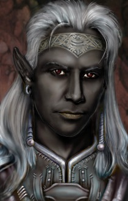

<html>

<b>Solaufein NPC</b>

<b>NPC mod for BG2EE and EET</b>

A mod originally written by Weimer. 
Solaufein of Ust Natha becomes an NPC who can join your party.  

- He's a Chaotic (Good/Neutral) Drow fighter/mage. 
- He has "plenty" of dialogue.
- He has a number of interjections in common SoA encounters. 
- He will banter twice with each other party member. 
- He will attempt to romance the PC regardless of race,
                gender or other loved ones. If you don't like it,
                just tell him to go away. 
- He can still Dimension Door (don't abuse it!).
- He can be abducted by Bodhi (watch out!). 
- Three Solaufein-specific challenges 
- Two Solaufein-specific rewards. 

  
  

 
&nbsp;

&nbsp;

</body>

</html>

